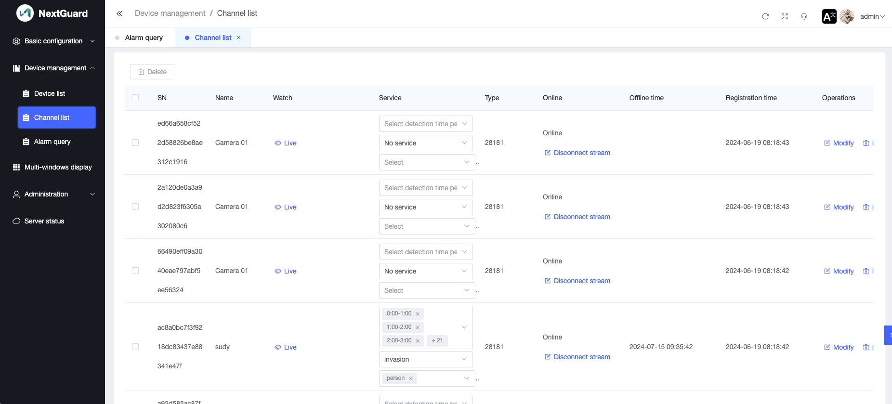
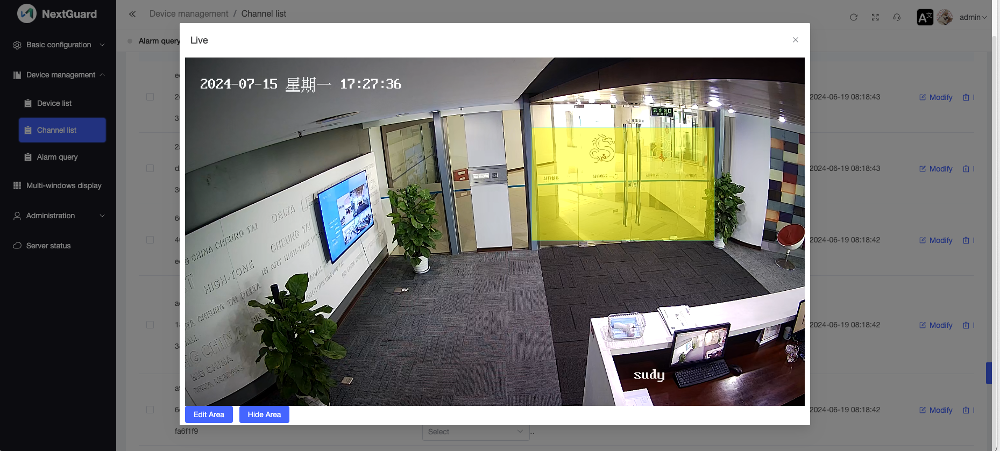
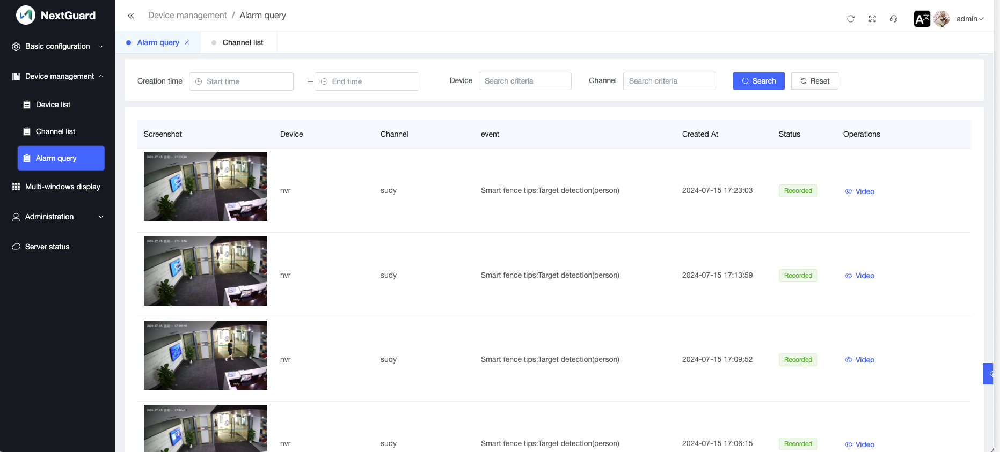
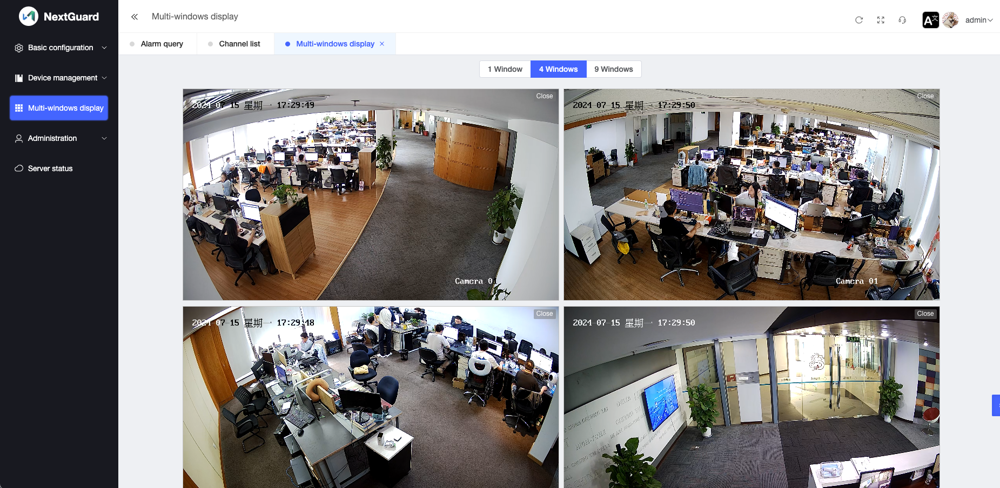

# NextGuard，Video surveillance software with AI capabilities

NextGuard is a video surveillance software based on ONVIF protocol, which can be installed locally and has AI function. NextGuard enables you to keep a close eye on the people or things you want to monitor.

## IP cameras connected to NextGuard

IP cameras with ONVIF protocol can be connected to NextGuard，such as Hikvision ip-cameras,Dahua ip-cameras,vivotek ip-cameras.

## AI Features

NextGuard can identify objects in the video in real time: people, dogs, cats, cars and many other objects. You can select the objects you need to pay attention to according to your monitoring needs. When the object you are concerned about appears in the video, NextGuard will automatically record a video as an alarm recording for you to review later.

Smart Fence, NextGuard allows you to draw a smart fence in the video area. When the object you are concerned about enters the fence, NextGuard will automatically record a video as an alarm recording for you to review later.

## Screenshots

### Video Channels

### Smart fence for video channels

### Alarm

### Real-time video view

## install

[insatll](./install.en.md)

## manual

[manual](./manual.en.md)

## How to ask questions?

If you have any questions about the project, we recommend you do the following:

1. Read the document carefully and check the issue if necessary.
2. If your problem is not solved yet, you can raise an issue.
3. If you need more timely and considerate technical support, you can contact us for paid technical support.

## License

The copyright of the code in this project belongs to icctvcloud. This project uses some open source software with IPC (Inter-Processor Call), and the relevant license agreements of these software have been specified in this software.

You are free to use this software for non-commercial projects as long as you retain the copyright information. 

If you need to use this software in a commercial project, please contact us for authorization.

## Acknowledgements

This project uses the following open source software, thanks for providing powerful functions!

[ffmpeg](https://ffmpeg.org/)
 
[postgresql](https://www.postgresql.org)

[redis](https://redis.io/)

[traefik](https://github.com/traefik/traefik)

[nginx](https://nginx.org/)

[ZLMediaKit](https://github.com/ZLMediaKit/ZLMediaKit)

[gin-vue-admin](https://github.com/flipped-aurora/gin-vue-admin)

[xgplayer](https://github.com/bytedance/xgplayer)

