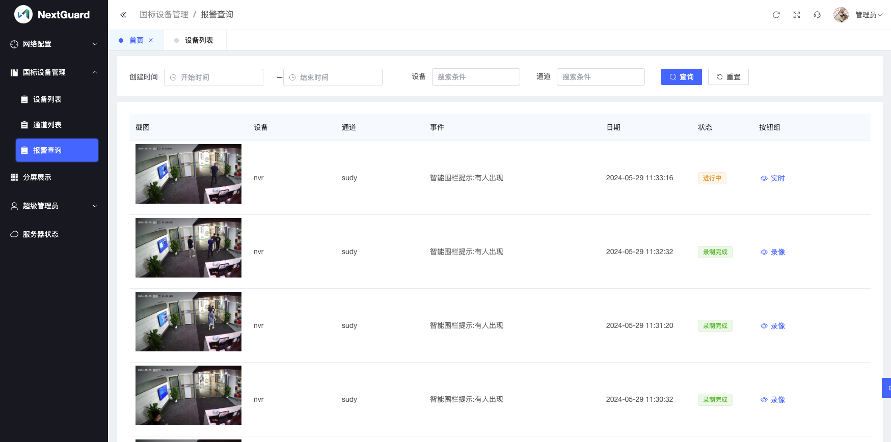

# NextGuard，开箱即用的具备AI能力的视频监控软件

NextGuard，是一款开箱即用的具备AI能力的视频监控软件。

## 监控视频接入

NextGuard，支持GB28181协议，海康、大华、宇视等品牌的IPC、NVR可以接入。

支持NAT穿越，NextGuard可以安装部署在公有云上，监控设备可以在内网通过宽带连接到云服务器。

支持国标级联，可以将现有的国标监控系统对接到NextGuard。

## AI功能

实时识别视频中的物体，NextGuard可以识别：人、狗、猫、汽车等多种物体。您可以根据您的监控需求，选择需要关注的物体。当视频中出现您关注的物体时，NextGuard会自动录制一段视频作为报警录像，供您事后查看。

智能围栏，NextGuard允许您在视频区域中绘制智能围栏，当您关注的物体进入围栏时，NextGuard会自动录制一段视频作为报警录像，供您事后查看。

## 软件截图

### 视频通道

### 视频通道的智能围栏

### 报警查询

### 视频实时浏览

## 安装部署

## 使用帮助

[使用帮助](./manual.md)

## 怎么提问？

如果要对项目有相关疑问，建议您这么做：

1. 仔细看下文档，如果有必要可以查看下issue。
2. 如果您的问题还没解决，可以提issue。
3. 如果需要获取更及时贴心的技术支持，可以联系我们付费获得技术支持。

## 授权协议

本项目自有代码版权属于icctvcloud。本项目以非源代码模式使用了一些开源代码软件，这些软件相关授权协议在本软件已一一指明。

在保留版权信息的情况下您可以自由将本软件应用于非商业的项目。 

如果您需要在商业项目中使用本软件，请与我们联系获得授权。

## 致谢

本项目使用了以下开源软件，感谢这些软件提供了强大的功能！

[ffmpeg](https://ffmpeg.org/)
 
[mysql](https://www.mysql.com/products/community/)

[redis](https://redis.io/)

[traefik](https://github.com/traefik/traefik)

[nginx](https://nginx.org/)

[ZLMediaKit](https://github.com/ZLMediaKit/ZLMediaKit)

[gin-vue-admin](https://github.com/flipped-aurora/gin-vue-admin)

[xgplayer](https://github.com/bytedance/xgplayer)

