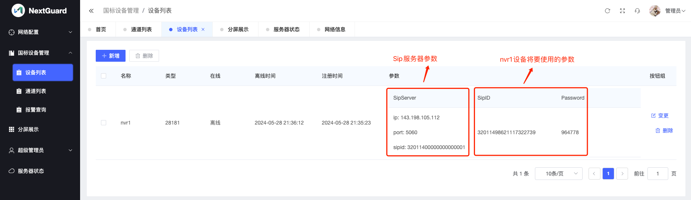
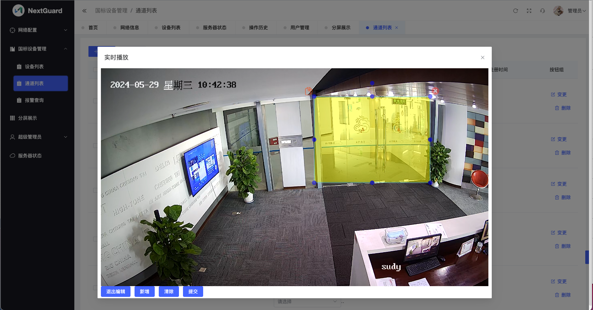
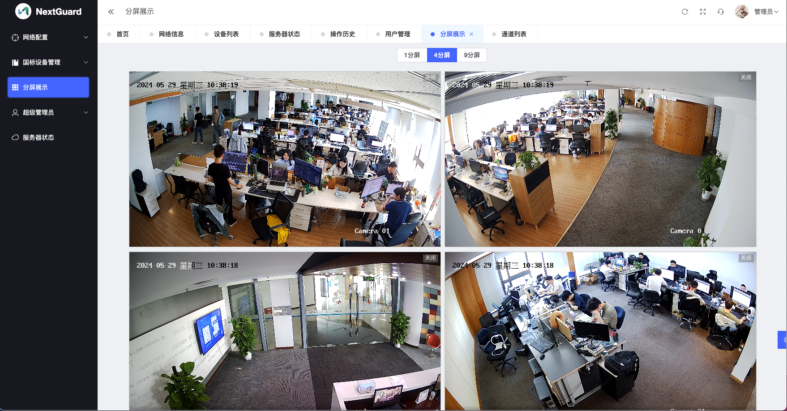

# NextGuard使用说明

## 登录

假设您的服务器ip为1.2.3.4，使用浏览器访问http://1.2.3.4

	初始用户名：admin
	初始密码：123456
	

## 初始化系统网络参数
第一次登录后，您需要初始化系统网络参数，否则系统的视频相关功能无法使用。

### ip参数
	
#### 在内网服务器上安装NextGuard
	
	假设服务器的ip为192.168.1.100，ip参数就填写192.168.1.100

#### 在公网服务器/云服务器上安装NextGuard
	
	ip参数就填写公网ip

### 域名参数

如果您安装NextGuard的公网服务器有域名，可以填写域名。填写域名后，您可以使用https访问NextGuard。

## 国标GB28181设备管理
您可以通过新增按钮将国标设备加入到NextGuard系统中。

### 海康设备的参数配置
如果您的视频监控设备是海康品牌，请看以下截图

### 大华设备的参数配置
如果您的视频监控设备是大华品牌，请看以下截图

## 视频通道管理

国标设备参数配置正确后，设备将连接到NextGuard服务器，会自动创建视频通道。

您可以根据需要，设置监控的时间段、监控的目标，监控的区域。

如果您需要监控视频中的某一些区域，可以编辑视频通道的智能围栏。

## 报警查询

## 视频实时浏览

