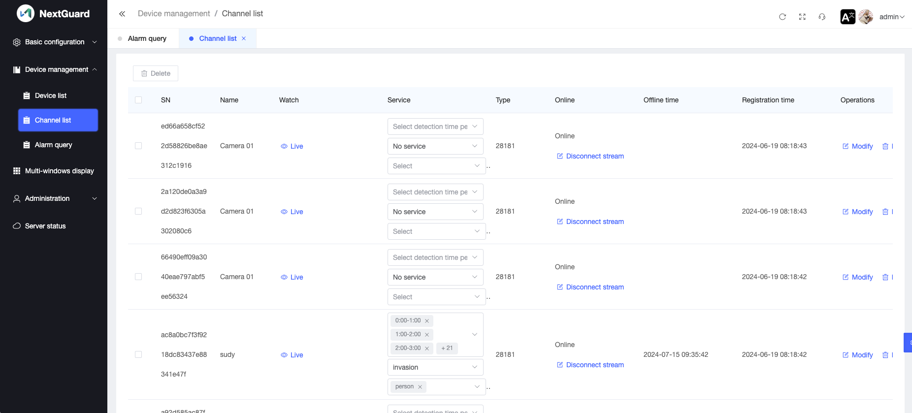
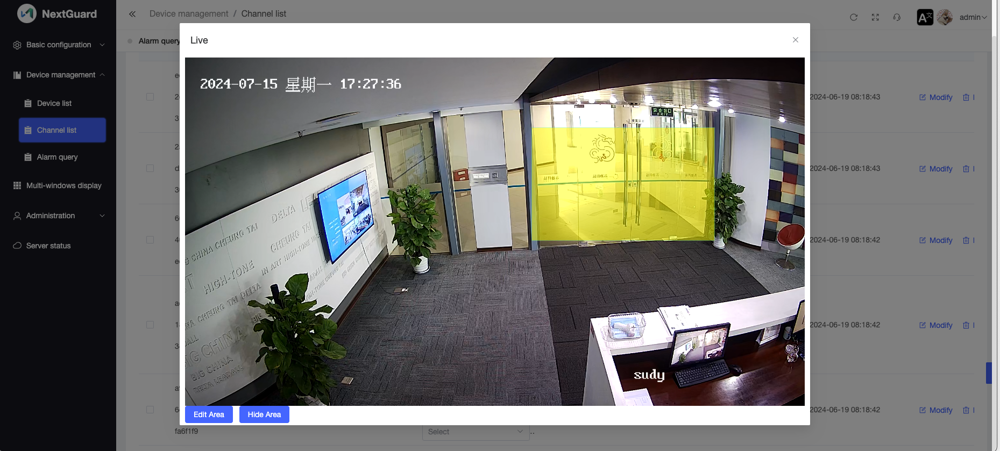

# NextGuard Manual

## Login

Assume your server IP is 1.2.3.4, use your browser to access http://1.2.3.4

	default username：admin
	default password：123456
	

## Initialize system network parameters
After logging in for the first time, you need to initialize the system network parameters, otherwise the system's video-related functions will not be available.

### ip parameters
	
#### Install NextGuard on the intranet server
	
	Assuming the server's IP is 192.168.1.100, fill in 192.168.1.100 for the IP parameter

#### Install NextGuard on a public server/cloud server
	
	For the ip parameter, fill in the public network ip

### Domain parameters

If the public network server where you install NextGuard has a domain name, you can fill in the domain name. After filling in the domain name, you can use https to access NextGuard.

## ONVIF IP-Camear manage
You can add ONVIF IP-Camera to the NextGuard system by clicking the Add button.

## Video channel manage

After the ONVIF IP-Camera parameters are configured correctly, the NextGuard server will connect to the IP-Camera and automatically create a video channel.

You can set the monitoring time period, monitoring target, and monitoring area according to your needs.

If you need to monitor certain areas in the video, you can edit the smart fence of the video channel.

### Alarm

### Real-time video view

